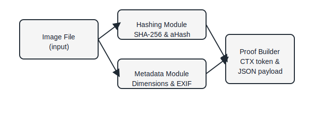

# PICYBOO NFT Image Proof Toolkit

## Überblick
Dieses Repository enthält ein schlankes Werkzeugset, das aus Bildern reproduzierbare Beschreibungen erzeugt. Es fasst kryptografische Fingerabdrücke, ein einfaches Wahrnehmungs-Hashing, grundlegende Metadaten sowie einen deterministischen Kontext-Token in einem JSON-Dokument zusammen. Damit lässt sich ein Bildzustand eindeutig referenzieren, ohne inhaltliche Details preiszugeben.

## Funktionsumfang
- **Kryptografisches Hashing:** SHA-256 als unveränderliche Signatur.
- **Perzeptuelles Hashing:** Durchschnitts-Hash (aHash) zur groben Ähnlichkeitserkennung.
- **Metadatenextraktion:** Bildabmessungen und verfügbare EXIF-Felder.
- **Kontextableitung:** HKDF-basierter Token (CTX), abgeleitet aus dem SHA-256 Hash.
- **Ausgabeformat:** JSON-Schema `PBO-NFT-PROOF/1.0` mit klar benannten Attributen.

## Architektur
Die Module sind voneinander getrennt, wodurch die Komponenten unabhängig getestet und wiederverwendet werden können.



- `src/hashing.js` kapselt Dateihash und aHash.
- `src/metadata.js` liefert Dimensionen sowie EXIF-Daten.
- `src/proof.js` orchestriert die Verarbeitung und erzeugt den JSON-Ausdruck.
- `bin/cli.js` stellt die Kommandozeilenschnittstelle bereit.

## Installation
```bash
npm install
```

## CLI-Verwendung
```bash
npx pboimg proof <pfad-zum-bild>
```
Die Ausgabe erscheint auf `stdout` als formatiertes JSON. Für Skripte kann mit `--silent` gearbeitet werden, um zusätzliche npm-Hinweise zu unterdrücken.

## Programmierschnittstelle
```js
import { buildImageProof } from 'picyboo-nft-image-proof';

const proof = await buildImageProof('examples/sample.png');
console.log(proof.hash_sha256);
```

## Beispielworkflow
Im Verzeichnis `examples/` liegt ein komplettes Ablaufbeispiel:
- `proof-demo.mjs` erzeugt für `sample.png` einen Nachweis.
- `output/sample-proof.json` enthält eine vorgefertigte Ausgabe.
- `README.md` beschreibt die Schritte vom Eingang bis zum JSON-Ergebnis.

Beispielausführung:
```bash
node examples/proof-demo.mjs
```

## Entwicklung
```bash
npm run lint
npm test
```

### Qualitätswerkzeuge
- **ESLint** (JavaScript Standard): `npm run lint`
- **Prettier** für Formatierung: `npm run format`
- **Jest** für Modultests: `npm test`

### Projektstatus
| Bereich            | Status                     |
| ------------------ | -------------------------- |
| CLI                | stabil, dokumentiert       |
| Node.js API        | stabil, mit Tests abgedeckt|
| Beispielabläufe    | bereitgestellt             |
| Erweiterungen      | siehe `ROADMAP.md`         |

Weitere Ideen und offene Punkte sind in `ROADMAP.md` skizziert.